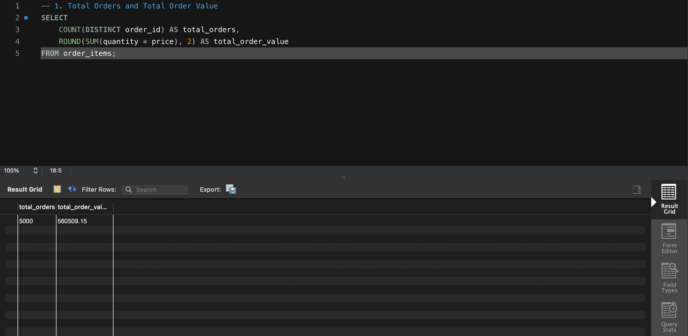
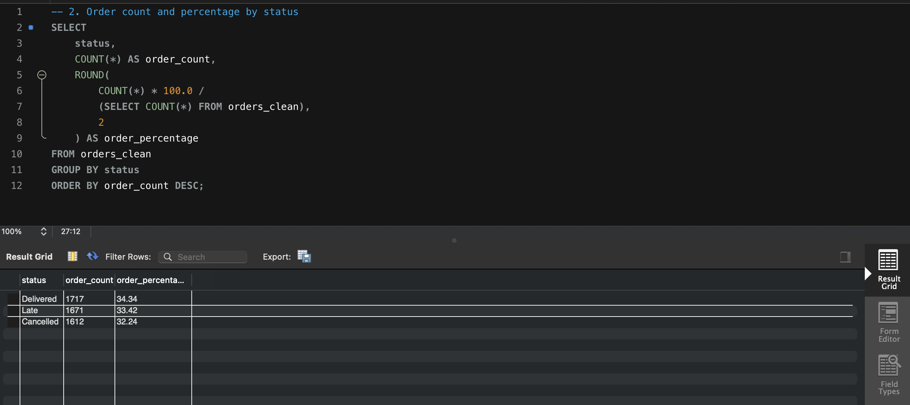

# Restaurant Order Analysis with MySQL

## Project Overview

This project analyses a relational food delivery dataset using MySQL.

The objective was to answer business-focused questions related to order activity, customer behaviour, restaurant performance, menu item sales, cuisine performance, and monthly trends.

The project uses five related tables and contains twelve separate SQL analyses. Each query is stored in an individual `.sql` file together with a screenshot of its result.

> Monetary metrics in this project represent total order value across all order statuses, including delivered, late, and cancelled orders.

---

## Dataset

The dataset represents a food delivery platform and contains information about:

- Customers
- Restaurants
- Menu items
- Orders
- Order items

### Tables

| Table | Description |
|---|---|
| `customers_medium` | Customer IDs, cities, and signup dates |
| `restaurants` | Restaurant IDs, cuisine types, cities, and ratings |
| `menu_items` | Menu item IDs, restaurant IDs, and item prices |
| `orders_medium` | Orders, customers, restaurants, dates, and order statuses |
| `order_items` | Products included in each order, quantities, and prices |

### Table Relationships

```text
customers_medium.customer_id
        ↓
orders_medium.customer_id

restaurants.restaurant_id
        ↓
orders_medium.restaurant_id

restaurants.restaurant_id
        ↓
menu_items.restaurant_id

orders_medium.order_id
        ↓
order_items.order_id

menu_items.item_id
        ↓
order_items.item_id
```

---

## Business Questions

The project answers the following questions:

1. What are the total number of orders and total order value?
2. How are orders distributed across different statuses?
3. How many orders were placed each month?
4. Which restaurants generated the highest total order value?
5. What were the top 10 best-selling menu items?
6. Which cuisine had the highest average order value?
7. Which cities generated the highest order value?
8. How did delivery performance vary by cuisine?
9. Which customers placed repeat orders?
10. How did total order value change monthly?
11. How can customers be segmented according to their spending?
12. How did restaurants compare in terms of order volume, order value, average order value, and rating?

---

## Key Insights

- The dataset contains **5,000 orders** with a total order value of **560,509.15** across all order statuses.
- Only **34.34%** of orders were marked as delivered, while late and cancelled orders together represented **65.66%** of all orders.
- Leeds recorded the highest order volume and total order value among the analysed cities.
- Thai cuisine had the highest average order value.
- The three restaurants with the highest total order value were all Thai restaurants.
- American cuisine recorded the highest delivery rate, while Chinese cuisine had the lowest delivery rate.
- The best-selling menu item by quantity was not the item generating the highest total order value, showing that sales volume and monetary performance do not always move together.
- Customer segmentation showed differences in spending and order frequency across customers.

---

## SQL Skills Demonstrated

This project demonstrates the use of:

- `SELECT`
- `WHERE`
- `INNER JOIN`
- `LEFT JOIN`
- Multi-table joins
- `GROUP BY`
- `HAVING`
- `ORDER BY`
- `COUNT`
- `COUNT(DISTINCT)`
- `SUM`
- `AVG`
- `ROUND`
- `CASE WHEN`
- Subqueries
- Date functions
- Customer segmentation
- Conditional aggregation

---

## Project Structure

```text
restaurant-sql-analysis/
│
├── README.md
│
├── sql/
│   ├── 01_total_orders_and_total_order_value.sql
│   ├── 02_order_status_distribution.sql
│   ├── 03_monthly_order_count.sql
│   ├── 04_order_value_by_restaurant.sql
│   ├── 05_top_10_best_selling_menu_items.sql
│   ├── 06_average_order_value_by_cuisine.sql
│   ├── 07_order_value_by_city.sql
│   ├── 08_order_performance_by_cuisine.sql
│   ├── 09_repeat_customers.sql
│   ├── 10_monthly_order_value_trend.sql
│   ├── 11_customer_segmentation.sql
│   └── 12_restaurant_performance_summary.sql
│
├── screenshots/
│   ├── 01_total_orders_and_total_order_value.png
│   ├── 02_order_status_distribution.png
│   ├── 03_monthly_order_count.png
│   ├── 04_order_value_by_restaurant.png
│   ├── 05_top_10_best_selling_menu_items.png
│   ├── 06_average_order_value_by_cuisine.png
│   ├── 07_order_value_by_city.png
│   ├── 08_order_performance_by_cuisine.png
│   ├── 09_repeat_customers.png
│   ├── 10_monthly_order_value_trend.png
│   ├── 11_customer_segmentation.png
│   └── 12_restaurant_performance_summary.png
│
└── data/
    ├── customers_medium.csv
    ├── menu_items.csv
    ├── order_items.csv
    ├── orders_medium.csv
    └── restaurants.csv
```

---

## Analysis Examples

### Total Orders and Total Order Value

```sql
SELECT
    COUNT(DISTINCT order_id) AS total_orders,
    ROUND(SUM(quantity * price), 2) AS total_order_value
FROM order_items;
```



### Order Status Distribution

```sql
SELECT
    status,
    COUNT(*) AS order_count,
    ROUND(
        COUNT(*) * 100.0 /
        (SELECT COUNT(*) FROM orders_medium),
        2
    ) AS order_percentage
FROM orders_medium
GROUP BY status
ORDER BY order_count DESC;
```



### Restaurant Performance Summary

The final analysis compares restaurants using total orders, total order value, average order value, cuisine, city, and customer rating.


---

## Tools Used

- MySQL
- MySQL Workbench
- SQL
- GitHub

---

## How to Run

1. Download or clone this repository.
2. Import the CSV files inside the `data` folder into MySQL.
3. Create the following tables:
   - `customers_medium`
   - `restaurants`
   - `menu_items`
   - `orders_medium`
   - `order_items`
4. Open any file from the `sql` folder in MySQL Workbench.
5. Select the project database.
6. Execute the query and review the result.

---

## Dataset Source

Dataset obtained from Kaggle:

https://www.kaggle.com/datasets/nudratabbas/sql-practice-dataset-2-medium-queries

---

## Author

**Murat**

Management Information Systems student interested in data analytics, SQL, business intelligence, and software development.
